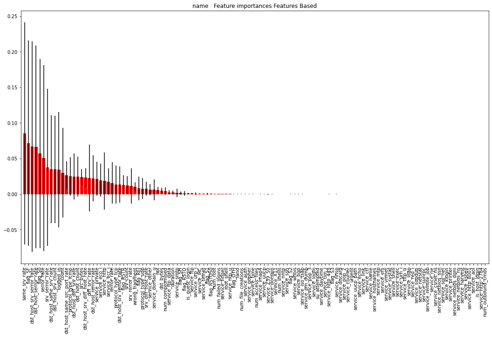
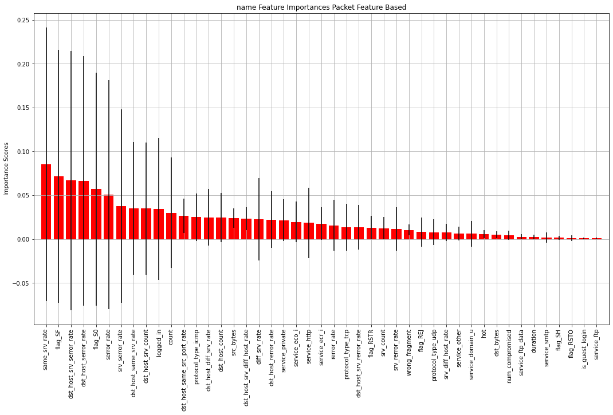

# NSL KDD Dataset Feature Importance Calculation With Forests of Trees

## importing of required libraries 


```python
import os
import pandas as pd
import numpy as np
%matplotlib inline
import matplotlib.pyplot as plt
import pandas as pd
from sklearn.ensemble import ExtraTreesClassifier
forest = ExtraTreesClassifier(n_estimators=250,
                              random_state=0)
```


```python
def fi(df,output,number_of_feature):
    X =df[df.columns[0:-1]]
    X=np.array(X)
    df[df.columns[-1]] = df[df.columns[-1]].astype('category')
    y=df[df.columns[-1]].cat.codes  
    
    
    
    ################## this part taken: https://scikit-learn.org/stable/auto_examples/ensemble/plot_forest_importances.html
    forest.fit(X, y)
    importances = forest.feature_importances_
    std = np.std([tree.feature_importances_ for tree in forest.estimators_],
                 axis=0)
    indices = np.argsort(importances)[::-1]

    # Print the feature ranking
    print("Feature ranking:")

    temp=list(df.columns)[0:-1]
    header=[]
    for f in range(X.shape[1]):
        print("%d. feature %d %s (%f)" % (f + 1, indices[f], temp[ indices[f]] ,importances[indices[f]]))
        header.append(temp[ indices[f]])
    # Plot the impurity-based feature importances of the forest
    plt.figure(figsize=(18,10))
    plt.title(output+"   Feature importances Features Based")

    plt.bar(range(X.shape[1]), importances[indices],
            color="r", yerr=std[indices], align="center")
    plt.xticks(range(X.shape[1]), header,rotation='vertical')
    plt.xlim([-1, X.shape[1]])


    graph_name=output+"_fi.pdf"
    plt.savefig(graph_name,bbox_inches='tight',format="pdf")#, dpi=400)
    plt.show()


    print("\n\n\n") 
    
    ##############################################################################################
    
    
    
    
    #FOCUSED GRAPH
   
    
    imp=[]
    for i,ii in enumerate (importances[indices]):
        imp.append(ii)
        #print(i,ii)
        if i==number_of_feature-1:break
    st=[]
    for i,ii in enumerate (std[indices]):
        st.append(ii)
        #print(i,ii)
        if i==number_of_feature-1:break
    hd=[]

    for i,ii in enumerate (header):
        hd.append(ii)
        #print(i,ii)
        if i==number_of_feature-1:break
            

    plt.figure(figsize=(18,10))
    plt.title(output+" Feature Importances Packet Feature Based")


    plt.bar(range(number_of_feature), imp,
            color="r", yerr=st, align="center")
    plt.xticks(range(number_of_feature), hd,rotation='vertical')
    plt.xlim([-1, number_of_feature])
    plt.ylabel("Importance Scores")
    #ax.set_ylim([0,2])
    plt.grid()
    graph_name=output+"fi_focused.pdf"
    plt.savefig(graph_name,bbox_inches='tight',format="pdf")#, dpi=400)
    plt.show()


    print("\n\n\n") 
    
    return imp,st,hd
            
```

# prepare NSL KDD dataset


## reading CSV files


```python
# c_names --->  column names
c_names = ["duration","protocol_type","service","flag","src_bytes",
    "dst_bytes","land","wrong_fragment","urgent","hot","num_failed_logins",
    "logged_in","num_compromised","root_shell","su_attempted","num_root",
    "num_file_creations","num_shells","num_access_files","num_outbound_cmds",
    "is_host_login","is_guest_login","count","srv_count","serror_rate",
    "srv_serror_rate","rerror_rate","srv_rerror_rate","same_srv_rate",
    "diff_srv_rate","srv_diff_host_rate","dst_host_count","dst_host_srv_count",
    "dst_host_same_srv_rate","dst_host_diff_srv_rate","dst_host_same_src_port_rate",
    "dst_host_srv_diff_host_rate","dst_host_serror_rate","dst_host_srv_serror_rate",
    "dst_host_rerror_rate","dst_host_srv_rerror_rate","labels","difficulty_degree"]

train = pd.read_csv( "data/KDDTrain+.csv", names=c_names) # train file
```

## deletion of unnecessary feature (difficulty_degree)


```python
del train["difficulty_degree"] 
```

## Converting object features to categories first and then to dummy tables (except "labels")


```python
for i in c_names:
    print((train[i].dtypes))
    if train[i].dtypes==object:
        train[i] = train[i].astype('category')
        if i=="labels":
            break
        train=pd.get_dummies(train, columns=[i])

```

    int64
    object
    object
    object
    int64
    int64
    int64
    int64
    int64
    int64
    int64
    int64
    int64
    int64
    int64
    int64
    int64
    int64
    int64
    int64
    int64
    int64
    int64
    int64
    float64
    float64
    float64
    float64
    float64
    float64
    float64
    int64
    int64
    float64
    float64
    float64
    float64
    float64
    float64
    float64
    float64
    object
    

# Move the labels property to the end of the dataset


```python
label=train["labels"]
del train["labels"]
train["labels"]=label
```

# What does the dataset look like?


```python
train
```


<div>
<style scoped>
    .dataframe tbody tr th:only-of-type {
        vertical-align: middle;
    }

    .dataframe tbody tr th {
        vertical-align: top;
    }

    .dataframe thead th {
        text-align: right;
    }
</style>
<table border="1" class="dataframe">
  <thead>
    <tr style="text-align: right;">
      <th></th>
      <th>duration</th>
      <th>src_bytes</th>
      <th>dst_bytes</th>
      <th>land</th>
      <th>wrong_fragment</th>
      <th>urgent</th>
      <th>hot</th>
      <th>num_failed_logins</th>
      <th>logged_in</th>
      <th>num_compromised</th>
      <th>...</th>
      <th>flag_RSTO</th>
      <th>flag_RSTOS0</th>
      <th>flag_RSTR</th>
      <th>flag_S0</th>
      <th>flag_S1</th>
      <th>flag_S2</th>
      <th>flag_S3</th>
      <th>flag_SF</th>
      <th>flag_SH</th>
      <th>labels</th>
    </tr>
  </thead>
  <tbody>
    <tr>
      <th>0</th>
      <td>0</td>
      <td>491</td>
      <td>0</td>
      <td>0</td>
      <td>0</td>
      <td>0</td>
      <td>0</td>
      <td>0</td>
      <td>0</td>
      <td>0</td>
      <td>...</td>
      <td>0</td>
      <td>0</td>
      <td>0</td>
      <td>0</td>
      <td>0</td>
      <td>0</td>
      <td>0</td>
      <td>1</td>
      <td>0</td>
      <td>normal</td>
    </tr>
    <tr>
      <th>1</th>
      <td>0</td>
      <td>146</td>
      <td>0</td>
      <td>0</td>
      <td>0</td>
      <td>0</td>
      <td>0</td>
      <td>0</td>
      <td>0</td>
      <td>0</td>
      <td>...</td>
      <td>0</td>
      <td>0</td>
      <td>0</td>
      <td>0</td>
      <td>0</td>
      <td>0</td>
      <td>0</td>
      <td>1</td>
      <td>0</td>
      <td>normal</td>
    </tr>
    <tr>
      <th>2</th>
      <td>0</td>
      <td>0</td>
      <td>0</td>
      <td>0</td>
      <td>0</td>
      <td>0</td>
      <td>0</td>
      <td>0</td>
      <td>0</td>
      <td>0</td>
      <td>...</td>
      <td>0</td>
      <td>0</td>
      <td>0</td>
      <td>1</td>
      <td>0</td>
      <td>0</td>
      <td>0</td>
      <td>0</td>
      <td>0</td>
      <td>neptune</td>
    </tr>
    <tr>
      <th>3</th>
      <td>0</td>
      <td>232</td>
      <td>8153</td>
      <td>0</td>
      <td>0</td>
      <td>0</td>
      <td>0</td>
      <td>0</td>
      <td>1</td>
      <td>0</td>
      <td>...</td>
      <td>0</td>
      <td>0</td>
      <td>0</td>
      <td>0</td>
      <td>0</td>
      <td>0</td>
      <td>0</td>
      <td>1</td>
      <td>0</td>
      <td>normal</td>
    </tr>
    <tr>
      <th>4</th>
      <td>0</td>
      <td>199</td>
      <td>420</td>
      <td>0</td>
      <td>0</td>
      <td>0</td>
      <td>0</td>
      <td>0</td>
      <td>1</td>
      <td>0</td>
      <td>...</td>
      <td>0</td>
      <td>0</td>
      <td>0</td>
      <td>0</td>
      <td>0</td>
      <td>0</td>
      <td>0</td>
      <td>1</td>
      <td>0</td>
      <td>normal</td>
    </tr>
    <tr>
      <th>...</th>
      <td>...</td>
      <td>...</td>
      <td>...</td>
      <td>...</td>
      <td>...</td>
      <td>...</td>
      <td>...</td>
      <td>...</td>
      <td>...</td>
      <td>...</td>
      <td>...</td>
      <td>...</td>
      <td>...</td>
      <td>...</td>
      <td>...</td>
      <td>...</td>
      <td>...</td>
      <td>...</td>
      <td>...</td>
      <td>...</td>
      <td>...</td>
    </tr>
    <tr>
      <th>125968</th>
      <td>0</td>
      <td>0</td>
      <td>0</td>
      <td>0</td>
      <td>0</td>
      <td>0</td>
      <td>0</td>
      <td>0</td>
      <td>0</td>
      <td>0</td>
      <td>...</td>
      <td>0</td>
      <td>0</td>
      <td>0</td>
      <td>1</td>
      <td>0</td>
      <td>0</td>
      <td>0</td>
      <td>0</td>
      <td>0</td>
      <td>neptune</td>
    </tr>
    <tr>
      <th>125969</th>
      <td>8</td>
      <td>105</td>
      <td>145</td>
      <td>0</td>
      <td>0</td>
      <td>0</td>
      <td>0</td>
      <td>0</td>
      <td>0</td>
      <td>0</td>
      <td>...</td>
      <td>0</td>
      <td>0</td>
      <td>0</td>
      <td>0</td>
      <td>0</td>
      <td>0</td>
      <td>0</td>
      <td>1</td>
      <td>0</td>
      <td>normal</td>
    </tr>
    <tr>
      <th>125970</th>
      <td>0</td>
      <td>2231</td>
      <td>384</td>
      <td>0</td>
      <td>0</td>
      <td>0</td>
      <td>0</td>
      <td>0</td>
      <td>1</td>
      <td>0</td>
      <td>...</td>
      <td>0</td>
      <td>0</td>
      <td>0</td>
      <td>0</td>
      <td>0</td>
      <td>0</td>
      <td>0</td>
      <td>1</td>
      <td>0</td>
      <td>normal</td>
    </tr>
    <tr>
      <th>125971</th>
      <td>0</td>
      <td>0</td>
      <td>0</td>
      <td>0</td>
      <td>0</td>
      <td>0</td>
      <td>0</td>
      <td>0</td>
      <td>0</td>
      <td>0</td>
      <td>...</td>
      <td>0</td>
      <td>0</td>
      <td>0</td>
      <td>1</td>
      <td>0</td>
      <td>0</td>
      <td>0</td>
      <td>0</td>
      <td>0</td>
      <td>neptune</td>
    </tr>
    <tr>
      <th>125972</th>
      <td>0</td>
      <td>151</td>
      <td>0</td>
      <td>0</td>
      <td>0</td>
      <td>0</td>
      <td>0</td>
      <td>0</td>
      <td>1</td>
      <td>0</td>
      <td>...</td>
      <td>0</td>
      <td>0</td>
      <td>0</td>
      <td>0</td>
      <td>0</td>
      <td>0</td>
      <td>0</td>
      <td>1</td>
      <td>0</td>
      <td>normal</td>
    </tr>
  </tbody>
</table>
<p>125973 rows × 123 columns</p>
</div>


# Calling the function to calculate the feature importance score


```python
graph_name="name" # save graphics with this name as pdf
number_of_feature= 45 # selects the first x feature with the highest score in the focused section
imp,st,hd=fi(train,graph_name,number_of_feature)
```

    Feature ranking:
    1. feature 25 same_srv_rate (0.085419)
    2. feature 120 flag_SF (0.071513)
    3. feature 35 dst_host_srv_serror_rate (0.066877)
    4. feature 34 dst_host_serror_rate (0.066346)
    5. feature 116 flag_S0 (0.057017)
    6. feature 21 serror_rate (0.050598)
    7. feature 22 srv_serror_rate (0.037683)
    8. feature 30 dst_host_same_srv_rate (0.035117)
    9. feature 29 dst_host_srv_count (0.034795)
    10. feature 8 logged_in (0.034671)
    11. feature 19 count (0.030033)
    12. feature 32 dst_host_same_src_port_rate (0.026609)
    13. feature 38 protocol_type_icmp (0.024968)
    14. feature 31 dst_host_diff_srv_rate (0.024948)
    15. feature 28 dst_host_count (0.024469)
    16. feature 1 src_bytes (0.023991)
    17. feature 33 dst_host_srv_diff_host_rate (0.023319)
    18. feature 26 diff_srv_rate (0.022917)
    19. feature 36 dst_host_rerror_rate (0.022167)
    20. feature 90 service_private (0.021526)
    21. feature 55 service_eco_i (0.019490)
    22. feature 65 service_http (0.018549)
    23. feature 56 service_ecr_i (0.017648)
    24. feature 23 rerror_rate (0.015793)
    25. feature 39 protocol_type_tcp (0.013534)
    26. feature 37 dst_host_srv_rerror_rate (0.013499)
    27. feature 115 flag_RSTR (0.013110)
    28. feature 20 srv_count (0.012429)
    29. feature 24 srv_rerror_rate (0.011625)
    30. feature 4 wrong_fragment (0.010463)
    31. feature 112 flag_REJ (0.008018)
    32. feature 40 protocol_type_udp (0.007974)
    33. feature 27 srv_diff_host_rate (0.007426)
    34. feature 85 service_other (0.006307)
    35. feature 53 service_domain_u (0.006124)
    36. feature 6 hot (0.005641)
    37. feature 2 dst_bytes (0.005231)
    38. feature 9 num_compromised (0.004339)
    39. feature 61 service_ftp_data (0.002761)
    40. feature 0 duration (0.002621)
    41. feature 95 service_smtp (0.001622)
    42. feature 121 flag_SH (0.001554)
    43. feature 113 flag_RSTO (0.001408)
    44. feature 18 is_guest_login (0.000873)
    45. feature 60 service_ftp (0.000829)
    46. feature 106 service_urp_i (0.000693)
    47. feature 41 service_IRC (0.000635)
    48. feature 101 service_telnet (0.000587)
    49. feature 117 flag_S1 (0.000492)
    50. feature 114 flag_RSTOS0 (0.000449)
    51. feature 12 num_root (0.000361)
    52. feature 7 num_failed_logins (0.000253)
    53. feature 59 service_finger (0.000197)
    54. feature 10 root_shell (0.000194)
    55. feature 84 service_ntp_u (0.000169)
    56. feature 111 flag_OTH (0.000152)
    57. feature 3 land (0.000138)
    58. feature 13 num_file_creations (0.000132)
    59. feature 45 service_auth (0.000130)
    60. feature 62 service_gopher (0.000097)
    61. feature 104 service_time (0.000087)
    62. feature 15 num_access_files (0.000085)
    63. feature 69 service_imap4 (0.000083)
    64. feature 107 service_uucp (0.000075)
    65. feature 43 service_Z39_50 (0.000071)
    66. feature 52 service_domain (0.000070)
    67. feature 42 service_X11 (0.000068)
    68. feature 14 num_shells (0.000065)
    69. feature 83 service_nntp (0.000049)
    70. feature 97 service_ssh (0.000049)
    71. feature 118 flag_S2 (0.000048)
    72. feature 110 service_whois (0.000040)
    73. feature 46 service_bgp (0.000040)
    74. feature 70 service_iso_tsap (0.000040)
    75. feature 86 service_pm_dump (0.000039)
    76. feature 88 service_pop_3 (0.000034)
    77. feature 75 service_login (0.000034)
    78. feature 11 su_attempted (0.000032)
    79. feature 50 service_daytime (0.000027)
    80. feature 103 service_tim_i (0.000025)
    81. feature 67 service_http_443 (0.000024)
    82. feature 119 flag_S3 (0.000024)
    83. feature 82 service_nnsp (0.000024)
    84. feature 51 service_discard (0.000023)
    85. feature 87 service_pop_2 (0.000022)
    86. feature 47 service_courier (0.000018)
    87. feature 5 urgent (0.000017)
    88. feature 108 service_uucp_path (0.000016)
    89. feature 54 service_echo (0.000015)
    90. feature 74 service_link (0.000015)
    91. feature 49 service_ctf (0.000014)
    92. feature 77 service_name (0.000014)
    93. feature 64 service_hostnames (0.000013)
    94. feature 76 service_mtp (0.000012)
    95. feature 57 service_efs (0.000012)
    96. feature 109 service_vmnet (0.000011)
    97. feature 100 service_systat (0.000011)
    98. feature 94 service_shell (0.000010)
    99. feature 58 service_exec (0.000010)
    100. feature 105 service_urh_i (0.000010)
    101. feature 102 service_tftp_u (0.000009)
    102. feature 73 service_ldap (0.000009)
    103. feature 91 service_red_i (0.000009)
    104. feature 99 service_supdup (0.000008)
    105. feature 81 service_netstat (0.000008)
    106. feature 98 service_sunrpc (0.000007)
    107. feature 92 service_remote_job (0.000006)
    108. feature 93 service_rje (0.000006)
    109. feature 48 service_csnet_ns (0.000006)
    110. feature 80 service_netbios_ssn (0.000006)
    111. feature 96 service_sql_net (0.000005)
    112. feature 71 service_klogin (0.000004)
    113. feature 89 service_printer (0.000004)
    114. feature 78 service_netbios_dgm (0.000003)
    115. feature 79 service_netbios_ns (0.000002)
    116. feature 63 service_harvest (0.000001)
    117. feature 72 service_kshell (0.000001)
    118. feature 68 service_http_8001 (0.000001)
    119. feature 44 service_aol (0.000001)
    120. feature 17 is_host_login (0.000000)
    121. feature 66 service_http_2784 (0.000000)
    122. feature 16 num_outbound_cmds (0.000000)
    





    
    
    
    
    





    
    
    
    
    

# List of top 45 features


```python
print ('%-5s %-25s %-25s %-25s' %("No","Importance Score","Standard Deviation","Feature Name"))
print ('%-5s %-25s %-25s %-25s' %("__","________________","__________________","____________"))
for i in range(len(imp)):
    print ('%-5s %-25s %-25s %-25s' %(i+1,imp[i],st[i],hd[i]))
    
    

```

    No    Importance Score          Standard Deviation        Feature Name             
    __    ________________          __________________        ____________             
    1     0.08541877835459762       0.15608762847225938       same_srv_rate            
    2     0.0715126329495212        0.14410100258757014       flag_SF                  
    3     0.06687675746585174       0.14786516391116508       dst_host_srv_serror_rate 
    4     0.066346211301629         0.14250820001379977       dst_host_serror_rate     
    5     0.0570168996187475        0.13270548222467024       flag_S0                  
    6     0.05059824741777188       0.13034275310379637       serror_rate              
    7     0.037683440633368356      0.11001664192796141       srv_serror_rate          
    8     0.035117018974980915      0.07569012892951156       dst_host_same_srv_rate   
    9     0.03479502386534906       0.07558018702662714       dst_host_srv_count       
    10    0.03467098639653562       0.08092480348147767       logged_in                
    11    0.030032863755838128      0.06309257831608235       count                    
    12    0.026609183533229924      0.01980281216988479       dst_host_same_src_port_rate
    13    0.024967587607099915      0.02708397211110129       protocol_type_icmp       
    14    0.02494787057724674       0.032536513778512965      dst_host_diff_srv_rate   
    15    0.024469259058899785      0.028096100636653777      dst_host_count           
    16    0.023990746384894297      0.011256508929679575      src_bytes                
    17    0.02331880947065069       0.012893965911553678      dst_host_srv_diff_host_rate
    18    0.022917093189360766      0.04705502666630768       diff_srv_rate            
    19    0.02216655165418429       0.032418970079455114      dst_host_rerror_rate     
    20    0.021525546658721823      0.023876827159024363      service_private          
    21    0.019489997063772555      0.02313708483432          service_eco_i            
    22    0.018549058889223726      0.039968499359808986      service_http             
    23    0.017647807545782702      0.01866707716633733       service_ecr_i            
    24    0.015792794774789773      0.028931186860282038      rerror_rate              
    25    0.013534433685204256      0.027039526105976115      protocol_type_tcp        
    26    0.013499123367919011      0.025548951543056725      dst_host_srv_rerror_rate 
    27    0.013110355377077934      0.013235343340733204      flag_RSTR                
    28    0.012428691461188109      0.01261493054322828       srv_count                
    29    0.011624521158259788      0.024828144954195674      srv_rerror_rate          
    30    0.01046277664077479       0.006027397164132387      wrong_fragment           
    31    0.008018051638573262      0.016600520246751186      flag_REJ                 
    32    0.007973786697546406      0.014926602170677613      protocol_type_udp        
    33    0.007426192863160025      0.009783061626885605      srv_diff_host_rate       
    34    0.006307124180762807      0.007646789455526549      service_other            
    35    0.006124228743258873      0.014459532046283802      service_domain_u         
    36    0.005640541788106428      0.00454943379110553       hot                      
    37    0.005231150633370187      0.003909570925593708      dst_bytes                
    38    0.004339292247485638      0.005449154150303683      num_compromised          
    39    0.0027606414006143007     0.003051403385162724      service_ftp_data         
    40    0.002621327285194019      0.0025849482116323996     duration                 
    41    0.0016221219674300818     0.005993559860935889      service_smtp             
    42    0.0015544607273336034     0.002195082539489958      flag_SH                  
    43    0.0014081665239780098     0.0032952392942288615     flag_RSTO                
    44    0.0008729895279251953     0.0009833945954346203     is_guest_login           
    45    0.0008294258464790644     0.0008731533908523693     service_ftp              
    
